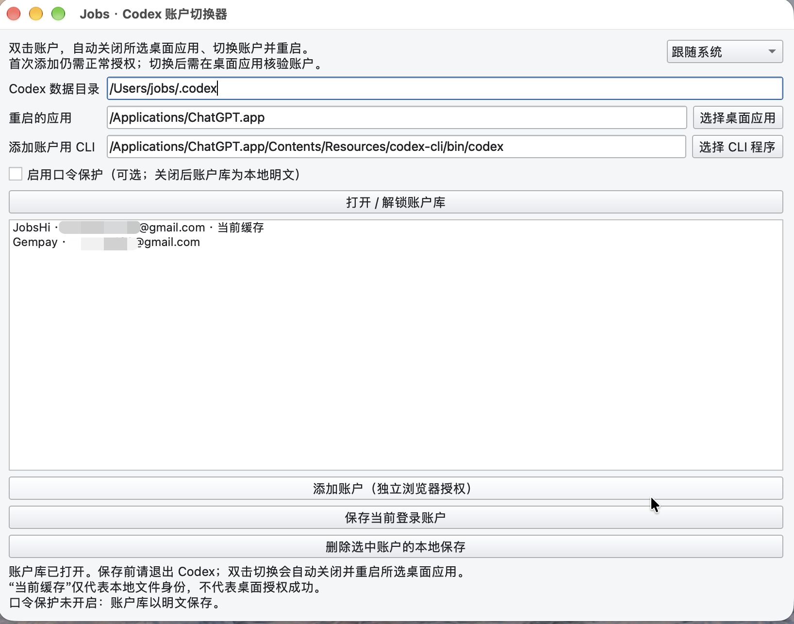
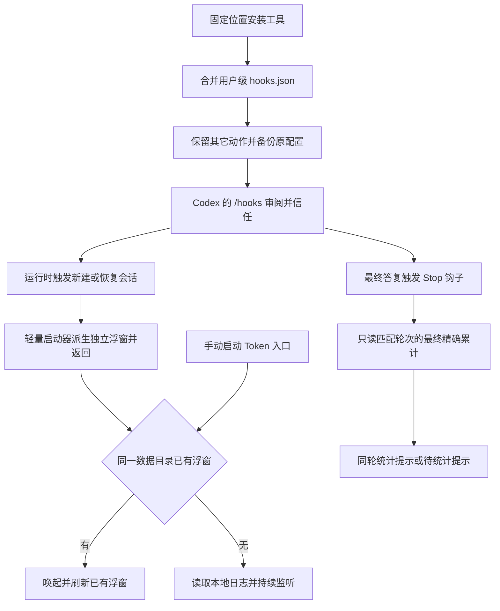

# `JobsCodexAccountSwitcher`


[toc]

---

## 🔥 <font id=前言>前言</font>

使用 [**Python**](https://www.python.org/) 和 [**PySide6**](https://doc.qt.io/qtforpython-6/) 编写的 [**Windows**](https://www.microsoft.com/windows) / [**macOS**](https://www.apple.com/macos/) 桌面工具，包含图形账户切换器与独立 Token 悬浮窗。通过保存、恢复 [**Codex**](https://openai.com/codex) 的文件登录缓存并重启桌面应用，减少双账户反复浏览器授权；浮窗从本地会话日志读取每轮模型用量。提供独立临时 `CODEX_HOME` 浏览器授权入口，添加账户不覆盖当前桌面登录文件。不修改 Codex 本体，不读取 [**Google**](https://www.google.com/) 密码，不自动执行退出登录或撤销 Token。

**账户切换兼容条件：桌面应用必须实际使用所选 Codex 数据目录中的 `auth.json`，且凭据存储为 `file`。文件切换不等于桌面授权成功；真实双账户端到端切换尚未验证。** `keyring` / `auto` / `ephemeral` 明确拒绝账户操作，工具不会擅自改配置。Token 浮窗独立运行，不读取账户库或登录凭据，不需要账户库口令。

入口导航：[账户操作](#account-operations) · [Token 浮窗与联动](#token-widget) · [开发与打包](#development) · [数据与恢复](#data-recovery) · [验证与排查](#verification)



## 一、<span id="features">功能与边界</span> <a href="#前言" style="font-size:17px; color:green;"><b>🔼</b></a> <a href="#🔚" style="font-size:17px; color:green;"><b>🔽</b></a>

| 功能 | 行为 |
| --- | --- |
| 保存账户 | 按本地身份区分账户；同一账户更新最新凭据；名称冲突拒绝覆盖 |
| 可选口令保护 | 默认免口令、明文保存；开启后全库使用 Scrypt 派生密钥和 Fernet 加密，包含名称、邮箱、Token |
| 切换 | 自动关闭所选应用，保存当前最新凭据，再原子替换目标缓存并重启应用 |
| 核验 | 本地文件匹配只标记“当前缓存”；桌面核验由用户确认 |
| 进程保护 | 按所选应用路径正常退出并等待，必要时清理其残留子进程；其它 CLI / IDE 客户端仍运行时拒绝写入 |
| 主题 | 窗口右上角紧凑下拉框，白天 / 黑夜 / 跟随系统；保存选择，跟随系统监听外观变化 |
| Token 悬浮窗 | 独立置顶窗口显示每轮输入 / 输出 Token、对话标题及本轮提问；记录可搜索和滚动 |
| 会话联动 | `SessionStart` 启动浮窗，`Stop` 为对应轮次返回用量提示；首次或命令变化后需官方审阅 |

JWT 解析仅用于本地账户匹配，不进行服务器验签，也不代表 Token 仍有效。会话过期、撤销、工作区策略变化时仍需重新浏览器授权。Mac 文件权限使用仅当前用户读写；Windows 依赖用户配置目录继承的 ACL，恢复后的 `auth.json` 是 Codex 所需的明文文件。

## 二、<span id="layout">目录与入口</span> <a href="#前言" style="font-size:17px; color:green;"><b>🔼</b></a> <a href="#🔚" style="font-size:17px; color:green;"><b>🔽</b></a>

```text
./
├── README.md
├── 【MacOS】📦生成dmg.command
├── 【Windows】📦生成exe.bat
├── dist/YYYY.MM.DD HH-mm-ss/      # 本机生成
│   ├── JobsCodexAccountSwitcher.app / .exe
│   ├── JobsCodexTokenWidget.app / .vbs
│   └── JobsCodexAccountSwitcher.dmg / .zip
├── work/                         # 忽略的构建中间文件
└── JobsCodexAccountSwitcher/
    ├── pyproject.toml
    ├── src/jobs_codex_account_switcher/
    │   ├── app.py / core.py / platforms.py
    │   ├── appearance.py
    │   └── usage.py / token_widget.py / token_hooks.py
    ├── scripts/
    └── tests/
```

macOS 必须在 Mac 本机生成 APP / DMG；Windows 必须在 Windows 本机生成 EXE / ZIP。成品包含 Python 和依赖，使用成品不需要安装 Python。第一层的 APP / DMG 符号链接或 EXE / ZIP / Token `.lnk` 仅在成功构建后发布，指向本次真实产物。

Mac DMG 含 `JobsCodexAccountSwitcher.app` 和 `JobsCodexTokenWidget.app`：将两个 APP 一起拖到应用目录并保持同层。Token APP 是轻量启动器，直接执行相邻主 APP 的程序并传入 `--token-widget`，不会打开账户窗口。Windows ZIP 含主 EXE 和 `JobsCodexTokenWidget.vbs`：解压后保持同层，双击 VBS 只打开浮窗；第一层 `JobsCodexTokenWidget.lnk` 直接指向真实 EXE 并携带同一参数。VBS 使用系统 Windows Script Host，不显示控制台；被系统策略禁用时，可从账户工具的“打开 Token 悬浮窗”按钮进入。

Windows 可选择普通安装或商店安装的实际 Codex EXE 路径；受保护的商店路径可能因权限拒绝启动，此时需通过系统正常启动应用。

## 三、<span id="account-operations">账户设置与操作</span> <a href="#前言" style="font-size:17px; color:green;"><b>🔼</b></a> <a href="#🔚" style="font-size:17px; color:green;"><b>🔽</b></a>

1、运行切换器，确认 Codex 数据目录与桌面程序路径。默认读取 `CODEX_HOME`，未设置时使用当前用户的 `.codex`。macOS 按 Bundle ID 发现应用，兼容桌面应用更名为 `ChatGPT.app`；Windows 提供候选安装路径和手动选择 EXE。

2、默认自动打开免口令账户库，直接添加或保存账户即可。需要加密时勾选“启用口令保护”，设置并确认至少 12 字符的口令；开启后每次运行需解锁。旧加密库先输入原口令，解锁后取消勾选即可关闭保护，已有账户会保留。口令不保存，忘记后无法解密已有加密库。关闭保护时不再要求口令，账户凭据以明文保存；不要把账户库或真实登录文件提交到 Git。

3、在 Codex 正常登录账户 A，结束任务并完整退出桌面应用、CLI 和 IDE 后端。点击“保存当前登录账户”，在“账户备注”中填写 A。

4、选择“添加账户（独立浏览器授权）”，在“账户备注”中填写 B，在打开的浏览器中选择另一个 Google 账户并授权。此流程需要原生 Codex CLI；在应用数据目录的独立临时目录完成授权，按当前口令保护模式保存后删除临时明文，不调用退出登录、不覆盖当前桌面登录文件。macOS 自动发现桌面应用内置 CLI，Windows 可手动选择 `codex.exe`，不使用 npm 的 `.cmd`。CLI 不可用时，仍可手动在 Codex 登录 B 后完整退出并保存；退出登录可能撤销原会话，需要重新授权。

5、双击 A 或 B，或右键目标账户选择“切换账户并启动 Codex”。确认后自动关闭所选应用、切换缓存并重启。正常退出失败时会终止该应用残留进程，运行中的任务会中断，请先保存工作。启动失败可调整应用路径后手动启动；切换前的账户凭据已同步保存到列表。

6、在桌面应用检查目标邮箱、工作区并正常发起任务，无需返回工具点击核验成功。需要切回时，再双击原账户即可。

“完整退出”不等于关闭窗口；Mac 使用退出应用，Windows 退出窗口及后台进程。任务、云端聊天、连接、远程配对、插件权限与订阅可能属于账户或工作区，工具不迁移这些数据，不保证切换后仍可使用原账户资源。

在账户列表中右键目标账户，选择“更改备注”。输入框预填原备注，确定后立即保存并保持选中；取消不修改。备注为 1～80 个字符，不能与其它账户重复。此操作不需要退出 Codex，也不会修改登录凭据。账户行及列表空白处的右键菜单均提供“刷新缓存状态”；账户列表支持鼠标滚轮、触控板和垂直滚动条，账户多时仍可上下查看。

## 四、<span id="token-widget">Token 浮窗与会话联动</span> <a href="#前言" style="font-size:17px; color:green;"><b>🔼</b></a> <a href="#🔚" style="font-size:17px; color:green;"><b>🔽</b></a>

### 4.1、<span id="token-operation">打开与使用</span> <a href="#前言" style="font-size:17px; color:green;"><b>🔼</b></a> <a href="#🔚" style="font-size:17px; color:green;"><b>🔽</b></a>

双击独立 Token 成品入口，或在账户窗口点击“打开 Token 悬浮窗”。浮窗可在 Codex 已经运行时立即接入日志，不关闭 Codex、不打断任务。关闭账户窗口不关闭浮窗；同一个 Codex 数据目录只保留一个浮窗，重复启动或重复钩子会唤起已有窗口，不产生重复控件。

浮窗默认置顶，显示对话标题和本轮提问摘要，拖动标题移动位置，数字支持选择和复制。`⋯ → 查看对话用量记录` 打开可搜索、可滚动的记录窗口，每行包含标题、提问、结束时间和输入 / 输出；双击记录或点“在浮窗显示所选轮次”可查看。菜单还提供白天 / 黑夜 / 跟随系统、重新加载和关闭。位置与外观单独保存。首次打开会读取近期已落盘记录，随后约每秒读取新增内容，每 10 秒发现新日志；最多保留 200 个近期轮次，无记录时保留重新加载入口。

标题优先来自只读的 `session_index.jsonl`，缺失时可查询未处于 WAL 模式的本地标题库；活跃 WAL 库安全跳过。标题不可读时回退短编号，同时保留提问摘要。摘要只截取用户实际请求的前 160 字符，跳过系统指导和附件路径包装，只在内存中展示。

### 4.2、<span id="token-counting">统计口径与限制</span> <a href="#前言" style="font-size:17px; color:green;"><b>🔼</b></a> <a href="#🔚" style="font-size:17px; color:green;"><b>🔽</b></a>

“一轮”指一次用户输入到该轮完成、失败或中断的过程；其中可能包含多次模型调用和工具调用。优先使用本地记录的精确 `turn_token_usage` 累计值，旧日志使用相邻 `total_token_usage` 累计值的差值汇总整轮，不把最后一次模型调用冒充整轮用量。轮次结束后显示最终记录；进行中只显示监听状态，后续补写的用量会更新相同轮次。

- **↑ 上行 / 输入**：模型实际输入 Token，包含历史上下文、工具内容和缓存输入；不是单纯按本轮输入文本长度估算。
- **↓ 下行 / 输出**：模型实际输出 Token，可包含推理 Token；不只统计最终可见回复。
- 缓存输入已计入上行，推理输出已计入下行；详情提示单独说明，不再重复相加。
- 只展示可归属的主对话轮次；子代理日志单独识别，不混入主对话数字，不宣称是主 / 子代理或整个账户的汇总。
- 用量缺失、累计重置、日志损坏或结束无法确认时显示“未知”或“部分 / 未知用量”，无记录显示 `—`，不会用 `0` 冒充缺失数据。

读取范围是所选 Codex 数据目录的 `sessions` 下近期 JSONL 文件，默认最多 64 份，每份首读末尾最多 16 MiB；已归档日志、远程主机、云端任务、尚未落盘的事件或不提供用量的客户端无法完整统计。较旧 / 较大的历史记录可能不在范围内。本工具不计算费用、不读取订阅额度，不提供账户级账单；输入 / 输出数字也不表示额度剩余量。

### 4.3、<span id="token-hooks">自动启动与官方审阅</span> <a href="#前言" style="font-size:17px; color:green;"><b>🔼</b></a> <a href="#🔚" style="font-size:17px; color:green;"><b>🔽</b></a>

先将成品安装到固定位置，再从账户窗口的联动菜单选择“启用会话启动联动”。程序为所选 Codex 数据目录的用户级 `hooks.json` 合并 `SessionStart` 的 `startup` / `resume` 动作和 `Stop` 用量提示，并立即打开浮窗以接入已经运行的会话。**首次安装或启动命令变化后，必须在 Codex CLI 的 `/hooks` 中审阅并信任这两个动作，后续联动才会生效。** 工具不自动批准钩子，也不修改 `config.toml` 或信任哈希。依据：[官方 Hooks 与审阅规则](https://learn.chatgpt.com/docs/hooks)。

`Stop` 使用官方 `systemMessage` 在对应轮次提供“本轮 Token：上行 / 下行 / 合计”的钩子提示，具体位置由客户端渲染，并非修改原回复正文。完整数字只使用匹配该轮且在最终答复之后落盘的精确累计；记录未到达时提示“待统计/未知”，浮窗随后更新。不会阻止轮次结束或触发额外模型回复。生成最终回复时无法预先读取包含该回复自身的最终 Token，因此不把截至生成前的数字冒充最终统计。

自动启动依赖当前客户端实际支持并加载官方用户级钩子。`SessionStart` 表示新建或恢复会话的事件；当前 Codex 实现在第一轮执行时消费待处理的启动事件，单纯打开或关闭空窗口不会触发它。当前会话的热接入由手动启动浮窗完成，无需重新创建会话，也不向 Codex 窗口注入插件或视图。实现依据：[官方轮次启动源码](https://github.com/openai/codex/blob/main/codex-rs/core/src/session/turn.rs)、[官方钩子运行时](https://github.com/openai/codex/blob/main/codex-rs/core/src/hook_runtime.rs)。

已有 `hooks.json` 只在真实改动前生成带时间戳的原文备份，文件名为 `hooks.json.jobs-token-widget.*.bak`；其它事件、命令和元数据保留。重复安装不会叠加本工具动作。选择“移除本工具的联动”只删除本工具标记的动作，保留其它钩子；浮窗可继续独立监听。格式异常、符号链接或并发修改时拒绝覆盖，先保留原文件并报告错误。

启动命令绑定安装时的解释器或成品位置。移动应用、删除虚拟环境或重新构建清理旧时间目录后，需从新位置重新安装联动并重新审阅；因此不建议把固定联动长期绑定在会清理的 `dist` 时间目录。

会话联动流程使用 [**Mermaid**](https://mermaid.js.org/) 保存可编辑源码：



## 五、<span id="development">开发与打包</span> <a href="#前言" style="font-size:17px; color:green;"><b>🔼</b></a> <a href="#🔚" style="font-size:17px; color:green;"><b>🔽</b></a>

需要 Python 3.11+。双击平台打包入口，先阅读内置自述。构建器创建 / 复用内层 `.venv`；依赖缺失时直接回车联网安装，任意非空输入取消，EOF 不代表同意。健康依赖不升级。直接调用构建器同样需要确认。

```shell
python3 ./JobsCodexAccountSwitcher/scripts/build.py
```

构建依赖为 [**PyInstaller**](https://pyinstaller.org/)、PySide6、[**cryptography**](https://cryptography.io/)、[**psutil**](https://psutil.readthedocs.io/)；Token 解析与钩子管理使用 Python 标准库，窗口及单实例通信使用 PySide6 / QtNetwork，不新增第三方依赖。Mac 额外使用系统 `hdiutil`，Windows 创建快捷方式需要系统 [**PowerShell**](https://learn.microsoft.com/powershell/) / WScript，独立 VBS 入口需要系统 Windows Script Host。安装失败立即停止，不清理旧产物。

打包前只清理本工具固定 `./dist/` 旧产物和指向该目录的旧快捷方式，拒绝符号链接 dist。每次构建共用本机时间 `YYYY.MM.DD HH-mm-ss`；成功后在第一层发布 Mac 账户 APP / Token APP / DMG 的相对链接，或 Windows 账户 EXE / Token 参数入口 / ZIP 的 `.lnk`，打开产物位置并启动新 Token 浮窗。账户工具保留独立入口，构建不安装钩子、不切换账户。成功结尾无需回车；失败不启动旧包。包未正式签名 / 公证。

源码运行：

```shell
python3 -m venv ./JobsCodexAccountSwitcher/.venv
./JobsCodexAccountSwitcher/.venv/bin/python -m pip install -e ./JobsCodexAccountSwitcher
PYTHONDONTWRITEBYTECODE=1 ./JobsCodexAccountSwitcher/.venv/bin/python ./JobsCodexAccountSwitcher/scripts/launch.py
```

Windows 使用 PowerShell，环境变量与解释器路径写法如下：

```powershell
$env:PYTHONDONTWRITEBYTECODE = '1'
& .\JobsCodexAccountSwitcher\.venv\Scripts\python.exe .\JobsCodexAccountSwitcher\scripts\launch.py --token-widget
```

只运行 Token 浮窗或管理用户级联动：

```shell
PYTHONDONTWRITEBYTECODE=1 ./JobsCodexAccountSwitcher/.venv/bin/python ./JobsCodexAccountSwitcher/scripts/launch.py --token-widget
PYTHONDONTWRITEBYTECODE=1 ./JobsCodexAccountSwitcher/.venv/bin/python ./JobsCodexAccountSwitcher/scripts/launch.py --install-token-hook
PYTHONDONTWRITEBYTECODE=1 ./JobsCodexAccountSwitcher/.venv/bin/python ./JobsCodexAccountSwitcher/scripts/launch.py --remove-token-hook
```

| 参数 | 行为 |
| --- | --- |
| 无模式参数 | 打开账户切换器 |
| `--token-widget` | 只打开浮窗，账户库及口令流程不加载 |
| `--install-token-hook` | 合并用户级钩子并打印配置 / 备份位置，不打开账户窗口 |
| `--remove-token-hook` | 只移除本工具钩子，不打开账户窗口 |
| `--hook-launch` | 钩子内部使用，后台派生浮窗后返回，不初始化 Qt 窗口 |
| `--hook-report` | 结束钩子读取标准输入事件，只输出官方 `systemMessage` JSON，不打开窗口 |
| `--codex-home PATH` | 显式指定数据目录；未传时读取 `CODEX_HOME`，再回退当前用户的 `.codex` |

模式参数互斥，路径含空格时整体加引号。源码和成品主程序共用这些参数。安装 / 移除命令会修改指定数据目录的 `hooks.json`，与只读的浮窗模式分开；安装完成仍需[官方审阅](#token-hooks)。

## 六、<span id="data-recovery">数据、日志与恢复</span> <a href="#前言" style="font-size:17px; color:green;"><b>🔼</b></a> <a href="#🔚" style="font-size:17px; color:green;"><b>🔽</b></a>

- `accounts.enc`：[**Qt**](https://www.qt.io/) 当前用户应用数据目录下 `Jobs/CodexAccountSwitcher` 的账户库。为兼容旧版保持文件名；免口令时内容为明文 JSON，开启口令后内容为密文，实际目录由系统决定；与源码、dist 分离，重新打包不清理账户库。
- 界面设置：Qt `QSettings` 保存外观、数据目录和应用路径，不保存口令或 Token。
- 构建日志：系统临时目录 `JobsCodexAccountSwitcher-build.log`；构建器异常记录在此，依赖安装和 PyInstaller 进度显示在终端。
- 应用不写凭据日志，界面只显示安全错误类型或明确的业务提示。
- 添加账户时临时目录 `enroll-*` 含短期明文凭据，正常完成或取消后删除。异常崩溃可能留下目录，确认工具已退出后删除；清理本机文件不撤销服务器会话。
- `instance.lock`：工具实例锁；Codex 数据目录的 `.jobs-account-switch.lock`：文件操作互斥锁。异常后需确认没有工具运行，再人工移除残留操作锁，禁止在并发切换时删除。
- Token 设置：独立的 `Jobs/CodexTokenWidget` 外观和位置设置；浮窗按 Codex 数据目录生成实例标识，锁在工具应用数据目录中，不写入 Codex 会话文件。
- 用量日志：只读原有 `sessions` 日志，在内存中重建近期轮次与提问摘要，不保存聊天内容副本，不上传日志或统计值。
- 钩子原文备份：位于所选 Codex 数据目录，`hooks.json.jobs-token-widget.*.bak`。需要恢复时先停止相关客户端，再对比并恢复明确的备份；备份可能包含其它钩子命令，不公开上传。
- 拷贝账户库到另一台电脑时，只有加密模式需要同一口令；免口令文件包含明文授权，可能暴露有效授权；默认每台机器分别正常授权，不提供自动同步。

## 七、<span id="verification">验证与常见问题</span> <a href="#前言" style="font-size:17px; color:green;"><b>🔼</b></a> <a href="#🔚" style="font-size:17px; color:green;"><b>🔽</b></a>

测试使用虚拟 Token 和临时目录，不访问真实 Google / ChatGPT 账户。测试覆盖密文与错误口令、源 / 目标凭据刷新保存、写入失败、运行保护、非 file 存储、名称冲突、锁、符号链接、独立授权录入及临时清理、三态主题与重启恢复，以及免口令默认打开、两种模式转换、旧加密库兼容、转换失败保护和取消设置。

2026-10-10 本机验收：161 项回归通过，Mac ARM64 的两个 APP 与 DMG 已生成、DMG 校验通过；成品 Stop 标准输入 / JSON 输出、真实最终用量读取、独立浮窗及重复启动单实例均实测通过。用户级两条钩子已在官方 CLI 中逐条审阅启用，配置命令可派生浮窗。未发送模型请求验证客户端同轮提示的最终显示位置，Windows 原生 GUI / 管道 / 打包仍待 Windows 实机验收。

```shell
cd ./JobsCodexAccountSwitcher
PYTHONDONTWRITEBYTECODE=1 PYTHONPATH=src .venv/bin/python -m unittest discover -s tests -v
```

**为什么需要退出应用？** 运行中的桌面应用或后端可能持有旧凭据并刷新写回，覆盖文件会产生竞争。双击切换时工具自动退出所选应用，确认进程停止后再切换，避免凭据互相覆盖。其它仍运行的 CLI / IDE 后端会显示进程名及 PID，需要自行关闭。

**为什么不支持直接退出登录再恢复？** 退出登录可能撤销会话，恢复旧文件不能恢复已被服务器撤销的授权。

**配置是 file，桌面仍未切换？** 说明桌面应用可能有独立登录层或受管策略；重新走官方登录。此版本未提供官方桌面热切换接口，也不绕过认证。

**是否修改当前 Codex 账户做过验证？** 开发验证只读取存储元信息，不改真实登录文件、不关闭当前应用。真实两个账户的桌面验证需要分别授权后进行；Windows 原生打包和界面需在 Windows 本机验收。

**浮窗为什么显示未知或暂时没有数字？** 当前客户端可能尚未将用量写入本地，或该轮尚未结束、日志缺失 / 损坏、轮次无法完整归属。保持浮窗监听或使用菜单重新加载；不要把显示为空当作实际用量为零。云端和其它主机的记录不会自动汇总到本机。

**启用联动后打开桌面应用没有出现浮窗？** 先在 Codex CLI 的 `/hooks` 中确认动作已审阅并信任，再确认当前客户端支持用户级钩子并实际触发新建 / 恢复会话。已打开的会话可直接双击 Token 入口热接入；仅启动桌面进程不代表 `SessionStart` 已触发。

**移动程序或重新构建后联动失效？** 钩子保留的是安装时的启动路径。先把新成品放入固定目录，再重新安装联动并完成审阅；既有配置会备份，其它钩子会保留。

**Windows Token VBS 被禁用？** 系统安全策略可能禁用 Windows Script Host 或 VBScript。第一层 Token `.lnk` 直接调用 EXE，或使用账户工具的浮窗按钮；Windows 原生入口仍需在目标机器实际验收。

参考：[官方认证与缓存说明](https://learn.chatgpt.com/docs/auth)、[官方 app-server 账户与用量事件](https://learn.chatgpt.com/docs/app-server)、[官方 Hooks 规则](https://learn.chatgpt.com/docs/hooks)。这些说明支持缓存、用量事件和钩子机制，但不能保证每版桌面应用都允许外部切换登录缓存。

<a id="🔚" href="#前言" style="font-size:17px; color:green; font-weight:bold;">我是有底线的➤点我回到首页</a>
